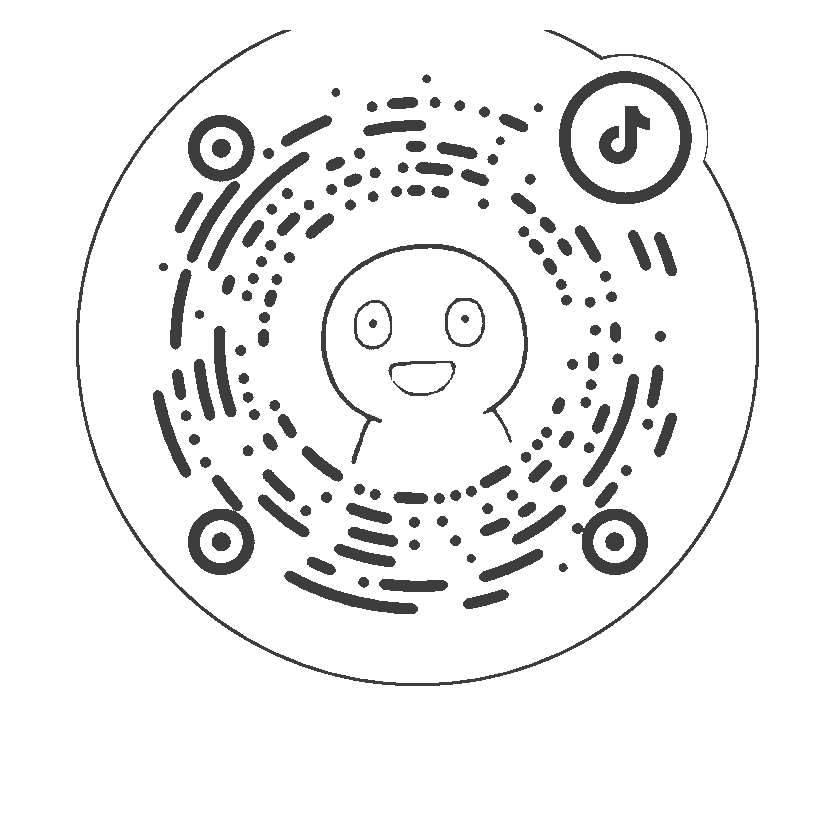

# Quota Capsule / 额度胶囊

Languages: [简体中文](README.zh-CN.md) | [English](README.en.md)

Quota Capsule is a small macOS quota runway capsule for heavy Codex users. It turns raw quota-window data into the working decision users actually need:

> At the current pace, can I keep working until the next reset?

Codex is the first supported provider, and the architecture remains agent-extensible. Other agent communities can contribute local source adapters while reusing the shared quota model, prediction engine, UI states, and product surface.

## Why It Exists

Heavy Codex users often run several coding tasks at the same time and repeatedly check usage pages. A bare percentage is evidence. The working decision is:

- Can I keep using Codex right now?
- Can the current pace last until reset?
- If it cannot last, when will I run out?
- If it can last, how much margin should remain at reset?

Quota Capsule stays small, visible, and direct:

- Safe: the current pace is likely enough to reach reset.
- Watch: usable for now, with a thin margin.
- Danger: likely to run out before reset at the current pace.
- Unknown: the source is missing, stale, or unreadable.

## Who It Is For

- Codex users who often run several tasks at once.
- People who repeatedly check quota or usage pages while working.
- Developers who want a local-first quota gauge they can inspect and modify.
- Agent communities that want to add their own quota source adapters.

## Current Status

The first local macOS beta is usable. It includes:

- Native floating desktop capsule.
- Menu bar status item.
- Read-only Codex app-server rate-limit adapter.
- 5-hour and weekly quota prediction.
- Local history snapshots.
- Multilingual UI.
- Public feedback links.

The native macOS app uses real local Codex rate-limit data. The browser/Vite demo remains as a visual prototype and exploration path for future Web or Chrome versions.

## Quick Start

Codex-assisted installation is the recommended early public test path. Open this repository and give the prompt below to your own Codex:

```text
Please install and run Quota Capsule on this Mac:
1. Open https://github.com/Bono12138/codex-quota-capsule
2. Read README.md, INSTALL.md, AGENTS.md, and package.json first.
3. Do not modify my Codex login state, log me out, reinstall Codex, or replace Codex binaries.
4. Only do local clone, dependency install, build, test, and launch.
5. Do not read, copy, print, or upload auth tokens, cookies, API keys, prompt text, session text, code content, or private file paths.
6. If Node, npm, Swift, Xcode Command Line Tools, or Codex CLI is missing, tell me before changing the system.
7. Run npm ci.
8. Run npm test.
9. Run npm run build.
10. Run swift run QuotaCapsuleCoreSpec.
11. Run npm run mac:run:internal-test -- --verify.
12. After it launches, tell me how to open it again.
```

Manual install:

```bash
git clone https://github.com/Bono12138/codex-quota-capsule.git
cd codex-quota-capsule
npm ci
npm test
npm run build
swift run QuotaCapsuleCoreSpec
npm run mac:run:internal-test -- --verify
```

## Local Channels

| Channel | App | Purpose |
| --- | --- | --- |
| Internal test | `Quota Capsule Beta.app` | Public beta build; feedback goes to public GitHub Issues. |
| Development | `Quota Capsule Dev Local.app` | Local owner/developer build; private issue URL must be configured explicitly. |

Run the native macOS beta:

```bash
npm run mac:run:internal-test
```

Run the development build:

```bash
QUOTA_CAPSULE_DEV_GITHUB_ISSUES_URL="https://github.com/<owner>/<private-repo>/issues" npm run mac:run:dev
```

## Privacy Boundary

- By default, the app reads and computes locally.
- Product events are not uploaded unless an analytics endpoint is configured.
- If an analytics endpoint is configured, basic diagnostics and product improvement data are sent in separate tiers.
- Prompt text, session text, code content, private file paths, account credentials, auth tokens, and cookies stay on this Mac.
- Missing or stale data is shown as `unknown`.

## Project Structure

```text
Sources/QuotaCapsuleMac/   Native macOS floating capsule and menu bar app.
Sources/QuotaCapsuleCore/  Swift provider-neutral model, prediction, and Codex app-server source.
apps/desktop/              Vite desktop UI mock for Web/Chrome exploration.
packages/core/             Provider-neutral quota model, prediction engine, and status copy.
packages/source-codex/     Codex-first local source probe and future adapter.
packages/analytics-collector/ Optional product improvement data receiver.
docs/product/              Product brief, MVP scope, roadmap, and acceptance criteria.
docs/distribution/         Distribution strategy, public repo manifest, and launch materials.
docs/decisions/            Project decision records.
scripts/                   Local helper scripts.
```

## Roadmap

- Better onboarding and in-product guidance.
- History trends and usage rhythm review.
- Chrome version.
- More agent provider adapters.
- Signed, notarized, packaged macOS distribution after the beta stabilizes.

## Feedback

- GitHub Issues: <https://github.com/Bono12138/codex-quota-capsule/issues>
- Email: `mmz1218bono@gmail.com`
- X: <https://x.com/starlightsz0>
- Douyin: 火腿肠 (`huotuichang439`)

You can also follow on Douyin and send feedback there:



## License

MIT. See [LICENSE](LICENSE).
