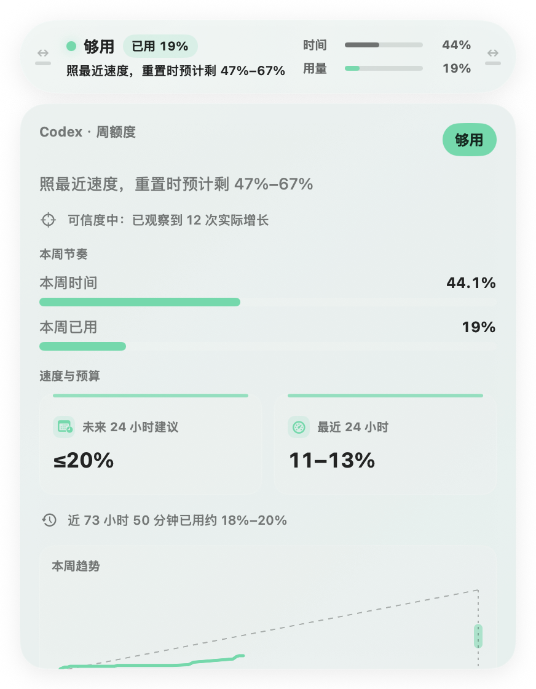
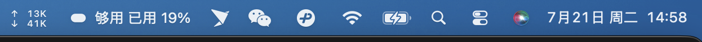

# Quota Capsule / 额度胶囊

Languages: [简体中文](README.zh-CN.md) | [English](README.en.md)

**A local-first macOS quota runway assistant for Codex.**

**一个本地优先、面向 Codex 重度用户的 macOS 额度判断胶囊。**

> At the current pace, can I keep working until the next weekly reset?
>
> 按现在这个速度，我能不能撑到下一次周额度重置？



## Why This Exists / 为什么做

A quota percentage tells you how much has been used. It does not tell you whether the remaining quota can support the way you are working now.

额度百分比只告诉你已经用了多少，却没有回答一个更直接的工作问题：**现在还能不能放心继续用？**

Heavy AI-native users may run several tasks at once, repeatedly check the usage page, hold back even when paid quota is still available, or discover too late that a large balance will expire at reset. Quota Capsule closes that judgment gap by comparing quota usage with elapsed time, recent pace, current activity, and available history.

AI-native 重度用户经常同时运行多个任务，也会反复查看 usage 页面：有时明明还有大量已付费额度，却因为不知道够不够而刻意收着用；有时又在临近重置时才发现还有很多额度没有用完。额度胶囊把已用额度、时间进度、最近速度、当前活动和可用历史证据合并成一句能直接行动的判断。

It reports six honest states—Early estimate, On track, Running fast, May run out, Exhausted, and Data unavailable—plus a next-24-hour budget and a forecast range for the balance at reset.

它会给出“初步判断、够用、偏快、可能不够、已用尽、数据暂不可用”六种诚实状态，并显示未来 24 小时建议和重置时的预计余量区间。

## Product Surfaces / 产品形态

Quota Capsule is designed to stay quiet until the user needs more detail:

- A small floating desktop capsule with the current judgment and weekly usage.
- A menu bar status item for glanceable, always-available context.
- An expanded panel with time and usage progress, pace evidence, forecast confidence, a sustainable line, reset timing, and local history.

额度胶囊尽量安静地常驻，只在用户需要时展开更多信息：

- 桌面悬浮胶囊显示当前判断与周已用比例。
- 菜单栏提供随时可见的一眼状态。
- 展开面板显示时间/用量进度、速度证据、预测置信度、可持续线、重置时间和本地历史。




## Current Beta / 当前 Beta

The current public prerelease is [v0.3.4-beta.1](https://github.com/Bono12138/codex-quota-capsule/releases/tag/v0.3.4-beta.1). It includes:

当前公开预发布版本是 [v0.3.4-beta.1](https://github.com/Bono12138/codex-quota-capsule/releases/tag/v0.3.4-beta.1)，已经包括：

- Native floating desktop capsule and menu bar item / 原生桌面悬浮胶囊和菜单栏入口。
- Read-only Codex app-server rate-limit source / 只读 Codex app-server rate-limit 数据源。
- Immediate first-reading estimate plus adaptive cycle, recent, activity, and historical pace evidence / 第一次有效读数即给初步估算，并逐步融合周期、近期、活动节奏和历史证据。
- Next-24-hour budget, last-24-hour usage, reset-balance range, and plain-language confidence / 未来 24 小时建议、最近 24 小时实际用量、重置余量区间和置信原因。
- Separate weekly-reset, last-successful-read, and next-automatic-read timing / 分开显示周额度重置、上次成功读取和下次自动读取。
- Current-cycle trend with a sustainable line, forecast band, and reset marker / 带可持续线、预测区间和重置标记的当前周期趋势。
- Local history snapshots and privacy-safe reset-credit lifecycle history / 本地历史快照与隐私安全的重置券生命周期历史。
- Multilingual UI and public feedback links / 多语言界面和公开反馈入口。

See [Forecast Methodology / 预测方法](docs/product/forecast-methodology.md) for equations, uncertainty, confidence, stale behavior, limits, and change control.

## Install / 安装

### Download the current beta / 下载当前 Beta

Download `Quota-Capsule-Beta-macOS.zip` from the [v0.3.4-beta.1 release](https://github.com/Bono12138/codex-quota-capsule/releases/tag/v0.3.4-beta.1).

从 [v0.3.4-beta.1 Release](https://github.com/Bono12138/codex-quota-capsule/releases/tag/v0.3.4-beta.1) 下载 `Quota-Capsule-Beta-macOS.zip`。

The current beta uses ad-hoc signing and is not yet notarized. macOS may require opening the app from Finder with **Right-click → Open**. See [INSTALL.md](INSTALL.md) for system requirements and Gatekeeper guidance.

当前 Beta 使用 ad-hoc 签名，尚未公证。macOS 可能要求在 Finder 中对应用执行**右键 → 打开**。系统要求和 Gatekeeper 处理方式见 [INSTALL.md](INSTALL.md)。

<details>
<summary>Codex-assisted installation / 使用 Codex 辅助安装</summary>

```text
Please install and run Quota Capsule on this Mac:
1. Open https://github.com/Bono12138/codex-quota-capsule
2. Read README.md, INSTALL.md, AGENTS.md, and package.json first.
3. Do not modify my Codex login state, log me out, reinstall Codex, or replace Codex binaries.
4. Only do local clone, dependency install, build, test, and launch.
5. Do not read, copy, print, or upload auth tokens, cookies, API keys, prompt text, session text, code content, or private file paths.
6. If Node, npm, Swift, Xcode Command Line Tools, or Codex CLI is missing, tell me before changing the system.
7. Run npm ci, npm test, npm run build, npm run audit:repository, swift test, and swift run QuotaCapsuleCoreSpec.
8. Run npm run mac:install and verify exactly one running process comes from /Applications.
9. After it launches, tell me how to open it again.
```

</details>

<details>
<summary>Build from source / 从源码构建</summary>

```bash
git clone https://github.com/Bono12138/codex-quota-capsule.git
cd codex-quota-capsule
npm ci
npm test
npm run build
npm run audit:repository
swift test
swift run QuotaCapsuleCoreSpec
npm run mac:install
```

</details>

## Privacy Boundary / 隐私边界

- Quota data is read and computed locally by default / 额度数据默认在本机读取和计算。
- Product events are not uploaded unless an analytics endpoint is explicitly configured and the relevant consent is enabled / 未显式配置 analytics endpoint 并启用相应授权时，不上传产品事件。
- Prompt text, session text, code content, private file paths, account credentials, auth tokens, and cookies stay on this Mac / prompt、session、代码、私有路径、账号凭据、auth token 和 cookie 留在本机。
- Reset-credit raw IDs, descriptions, and referral payloads are not stored; only a SHA-256 identity fingerprint and safe timestamps/status facts remain in local history until the user clears it / 重置券原始 ID、描述和 referral 内容不落盘，仅保存 SHA-256 指纹以及安全的时间和状态事实。
- Missing or stale quota data is shown as `Data unavailable`; stale percentages never produce a new safety judgment / 缺失或过期数据显示为“数据暂不可用”，不会用旧百分比生成新的安全判断。

## Reuse and Integration / 复用与集成

Quota Capsule is MIT-licensed. Another macOS product can adopt the whole project or reuse selected layers:

额度胶囊采用 MIT License。其他 macOS 产品可以整体采用，也可以只复用其中一层：

- `Sources/QuotaCapsuleCore/`: provider-neutral Swift quota model, forecasting, history, and the read-only Codex source / Swift 通用额度模型、预测、历史和只读 Codex 数据源。
- `Sources/QuotaCapsuleMac/`: native floating capsule, expanded panel, menu bar surface, settings, and local persistence / 原生悬浮胶囊、展开面板、菜单栏、设置和本地持久化。
- `packages/core/` and `packages/source-codex/`: TypeScript model and source packages for Web, Chrome, or adapter exploration / 面向 Web、Chrome 或 adapter 探索的 TypeScript 模型和数据源包。
- `docs/product/`: product contract, forecast methodology, acceptance criteria, and edge-case decisions / 产品契约、预测方法、验收标准和边界决策。

You are welcome to integrate, modify, merge, or redistribute the code under the terms of [LICENSE](LICENSE). Contributions for other agent-provider adapters are also welcome.

欢迎按照 [LICENSE](LICENSE) 的条款集成、修改、合并或再发布代码，也欢迎为其他 Agent 产品贡献 source adapter。

## Roadmap / 路线图

- Better onboarding and in-product guidance / 更完整的新手引导和产品内提示。
- Longer-term history and usage-rhythm review / 更长期的历史趋势和使用节奏复盘。
- Chrome version / Chrome 独立版本。
- More agent-provider adapters / 更多 Agent provider adapter。
- Signed, notarized, packaged macOS distribution after the beta stabilizes / 内测稳定后补签名、公证和正式 macOS 分发。

## Feedback / 反馈

- GitHub Issues: <https://github.com/Bono12138/codex-quota-capsule/issues>
- Email: `mmz1218bono@gmail.com`
- X: <https://x.com/starlightsz0>
- Douyin / 抖音：火腿肠（`huotuichang439`）


## License / 许可证

MIT. See [LICENSE](LICENSE).
