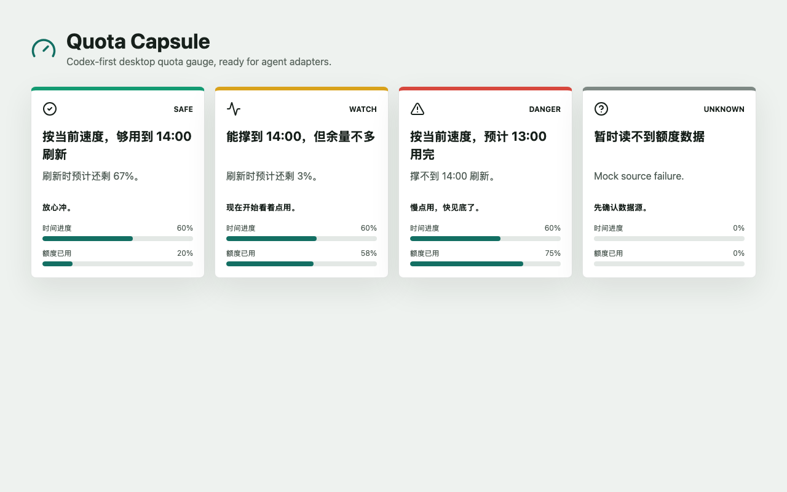

# 竞品、视觉与产品档案

日期：2026-07-01

## 目的

这份文档记录 Quota Capsule 目前已经做过的竞品调研、本地试用、视觉观察和产品判断。

以后如果继续讨论产品形态、视觉方向、商业化或定位，先看这份文档，避免重复调研。

## 调研范围

已看过的项目：

- QuotaGem：`https://github.com/gyozalab/QuotaGem`
- ClaudeBar：`https://github.com/tddworks/ClaudeBar`
- Codex Quota Viewer：`https://github.com/Half-Melon/Codex-Quota-Viewer`
- codex-quota / CQ：`https://github.com/deLiseLINO/codex-quota`
- opencode-quota：`https://github.com/slkiser/opencode-quota`

本地竞品实验目录：

```text
/Users/Zhuanz/Documents/quota-competitor-lab
```

## 截图档案

公开仓库边界：

- 仓库里只提交我们自己的 Quota Capsule demo 截图。
- 第三方竞品截图放在 ignored 的本地目录里，因为部分竞品仓库当前本地 clone 根目录没有明确 `LICENSE` 文件。
- 未重新确认授权前，不要把 `local-state/` 里的第三方截图发布到公开 GitHub。

我们当前 demo：



本地第三方截图档案：

```text
/Users/Zhuanz/Documents/codex-quota-capsule/local-state/competitor-visual-archive/
```

代表性截图：

| 项目 | 本地截图 | 内容 |
| --- | --- | --- |
| QuotaGem | `local-state/competitor-visual-archive/quotagem-compact-panel.png` | compact 面板，用环形图显示多个 provider 的用量。 |
| QuotaGem | `local-state/competitor-visual-archive/quotagem-expanded-panel.png` | expanded 面板，同时展示 5h 和 weekly。 |
| QuotaGem | `local-state/competitor-visual-archive/quotagem-settings-panel.png` | 设置页，包括语言、显示模式、阈值、通知。 |
| ClaudeBar | `local-state/competitor-visual-archive/claudebar-dashboard-dark.png` | macOS 菜单栏 dashboard，视觉完成度较高。 |
| ClaudeBar | `local-state/competitor-visual-archive/claudebar-dashboard-light.png` | ClaudeBar light 版本。 |
| Codex Quota Viewer | `local-state/competitor-visual-archive/codex-quota-viewer-menu.png` | macOS 菜单栏 quota/account 界面。 |
| Codex Quota Viewer | `local-state/competitor-visual-archive/codex-quota-viewer-session-manager.png` | 内置 session manager，说明产品范围很重。 |
| codex-quota | `local-state/competitor-visual-archive/codex-quota-tui-demo.png` | 终端 TUI quota/account 视图。 |
| codex-quota | `local-state/competitor-visual-archive/codex-quota-tui-demo.gif` | TUI 交互动图。 |

竞品源截图路径仍保留在实验目录：

```text
/Users/Zhuanz/Documents/quota-competitor-lab/QuotaGem/docs/images/
/Users/Zhuanz/Documents/quota-competitor-lab/ClaudeBar/docs/screenshots/
/Users/Zhuanz/Documents/quota-competitor-lab/Codex-Quota-Viewer/docs/images/
/Users/Zhuanz/Documents/quota-competitor-lab/codex-quota/
```

## 各项目产品形态

### QuotaGem

真实产品形态：

- Windows 托盘应用。
- 点击托盘后打开 compact 或 expanded 面板。
- 不是 Chrome 插件。
- 本地 `http://127.0.0.1:5174/` 只是前端预览，不是它真实生产形态。

它证明了什么：

- Windows tray 路线已经有认真竞品。
- 环形图适合快速理解 quota。
- 5h 和 weekly 可以同时存在于一个界面。
- `codex app-server` 是重要的 Codex quota 数据源。

和 Quota Capsule 的差异：

- QuotaGem 是多 provider monitor。
- 默认交互是打开一个 panel 看 dashboard。
- 警告逻辑更偏百分比阈值，而不是把“节奏判断”作为核心。
- 它不是一个默认常驻桌面、回答“现在还能不能继续干活”的小胶囊。

视觉观察：

- compact ring 很值得参考。
- expanded panel 比普通工具页更有质感。
- 森林背景 + glass 风格有记忆点，但不一定适合我们更安静的工作区常驻体验。

### ClaudeBar

真实产品形态：

- macOS 菜单栏应用。
- 点击菜单栏后打开漂亮的 quota dashboard。
- 支持多个 AI coding assistant 和多主题。

它证明了什么：

- quota 工具可以做得像正经消费级产品，不一定只能像脚本。
- pace-aware 逻辑有价值。
- 主题和菜单栏常驻对 power user 有吸引力。

和 Quota Capsule 的差异：

- ClaudeBar 是泛 AI usage monitor。
- 它更 dashboard-heavy。
- 默认不是桌面悬浮胶囊。
- 它不是围绕 Codex 单一高频痛点做极简判断。

视觉观察：

- 目前看到的竞品里，它的视觉完成度最高。
- 渐变、卡片、tab、badge 都比较成熟。
- 但它对我们默认界面来说太重；我们要学“完成度”，不要学“大 dashboard”。

### Codex Quota Viewer

真实产品形态：

- macOS 菜单栏应用。
- 包含 quota、账户库、安全账号切换、配置写入、session manager。

它证明了什么：

- Codex-specific native app 是有需求的。
- `account/rateLimits/read` 通过 `codex app-server` 读取 quota 是可信路径。
- stale / read failure 状态很重要。

和 Quota Capsule 的差异：

- 它是 Codex 本地管理中心，不是 quota pacing assistant。
- 它会处理账号、配置、session，信任成本更高。
- 我们 MVP 应明确不做这些重功能。

视觉观察：

- 实用、系统感强。
- 适合作为“不要变重”的反例。
- session manager 截图提醒我们：一旦做账号/session 管理，产品会迅速变成另一类工具。

### codex-quota / CQ

真实产品形态：

- 终端 TUI。
- 主要服务账号切换和 quota monitoring。

它证明了什么：

- 开发者接受键盘优先的 quota/account 工具。
- mock/demo 模式适合安全试用。

和 Quota Capsule 的差异：

- 不是大众用户体验。
- 不常驻桌面，除非一直开着终端。
- 不适合作为我们的视觉方向。

视觉观察：

- 对 terminal user 清楚。
- 对“漂亮常驻小胶囊”帮助有限。

### opencode-quota

真实产品形态：

- OpenCode 插件 + CLI。
- 支持 sidebar panel、toast、compact status line、slash command、terminal show。

它证明了什么：

- quota 最好出现在工作发生的地方。
- 同一套数据层可以支持多种显示 surface。
- CLI / JSON 输出对生态集成有价值。

和 Quota Capsule 的差异：

- 它绑定 OpenCode 生态。
- 不是独立桌面产品，也不是独立 Chrome 视觉产品。
- 它更像集成层，不是 ambient consumer-facing capsule。

视觉观察：

- 产品形态上值得学：让 quota 嵌入工作流。
- 视觉上不是我们的主要参考。

## 数据源经验

最重要的数据源路径：

```text
codex app-server
JSON-RPC initialize
account/rateLimits/read
```

竞品代码里看到的关键字段：

- `usedPercent`
- `windowDurationMins`
- `resetsAt`
- `primary`
- `secondary`

对我们的意义：

- `packages/source-codex` 应从 CLI help probe 升级为只读 app-server quota probe。
- 5h / weekly 不应假设 primary/secondary 顺序，而应按 `windowDurationMins` 判断。
- 读取失败必须显示 unknown/gray，不能显示 safe/green。

## 产品重叠

我们和竞品重叠的地方：

- 都显示 quota。
- 都关心 5h 和 weekly。
- 都显示 reset time。
- 都有绿色/黄色/红色状态。
- 都可能支持 provider adapter。

所以不能假装这是空白赛道。

## 我们真正的差异

Quota Capsule 不应该做成“又一个 quota dashboard”。

真正差异是：

- 默认常驻桌面的小胶囊。
- Codex-first 的高频痛点。
- 把 pacing judgment 放在第一层。
- 用“时间进度 vs 额度已用”解释判断。
- 先给一句人话，再给数字。
- MVP 不做账号切换。
- MVP 不做 session manager。
- 默认不做复杂 dashboard。

核心承诺：

> 把 quota 从静态数字变成续航判断：现在这个使用速度，能不能撑到刷新？

## 视觉方向

应该做：

- 第一状态要小、安静、可扫视。
- 状态颜色只做细节强调，不要铺满整个 UI。
- 一句话判断优先于一堆指标。
- 只在用户点开后显示详细解释。
- 5h 是主状态，weekly 是辅助压力。
- 设计时要考虑它长期和 Codex、IDE、浏览器、终端一起出现。

不要做：

- 普通后台 dashboard。
- landing page 式 hero。
- 大面积装饰性渐变。
- 默认多卡片密集布局。
- MVP 做账号/session 管理。
- 直接复制竞品视觉资产或布局。

## 当前 Quota Capsule demo 评价

当前 demo 方向是对的：

- 有 safe/watch/danger/unknown。
- 有人话判断。
- 有时间进度和额度已用两条对比。

但它还不是最终产品：

- 四个状态并排适合测试，不是真实用户 workflow。
- 卡片仍然像 spec demo，不像精致常驻小组件。
- 生产版默认应该是一个小胶囊，点击或 hover 后展开详情。

## 产品决策

继续独立做 Quota Capsule。

原因：

- 竞品验证了需求，但没有覆盖“ambient quota runway capsule”这个体验。
- 数据源思路可以借鉴，不需要继承它们的产品范围。
- fork 重型项目会把我们拖进 account/session/dashboard。
- 独立开源项目更适合讲清楚自己的设计主张，并邀请 adapter 贡献。

可以给上游贡献小 patch，但这不是主线：

- 贡献 source adapter 修复。
- 分享只读 Codex app-server 经验。
- 不要把 Quota Capsule 变成别人 dashboard 里的一个 feature。

## 还要继续讨论的问题

- Chrome 插件到底能否安全、稳定地拿到真实 quota 数据？
- Chrome 版本应该是 toolbar popup、页面 overlay、还是固定小 badge？
- weekly quota 在默认胶囊里出现到什么程度才不打扰？
- Mac local 第一版是只做悬浮胶囊，还是悬浮胶囊 + 菜单栏一起做？
- 中英文状态文案怎么写最准确、不吓人、不含糊？

